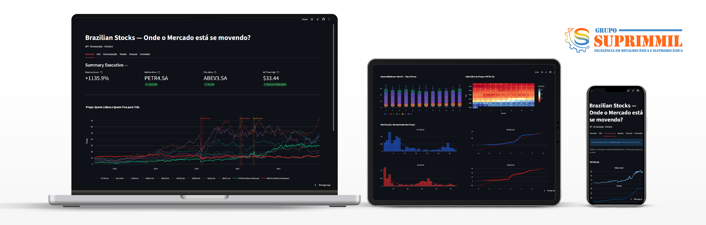

# Grupo Suprimmil — Site Institucional

Site institucional do Grupo Suprimmil, holding de metalmecânica e eletromecânica com atuação no Pará, Ceará e São Paulo.

**Stack:** Next.js 15 + TypeScript + Tailwind CSS v4 + shadcn/ui + Base UI  
**Animações:** Framer Motion + GSAP/ScrollTrigger  
**Tema:** Azul-aço (`#2E5C8A`) + Laranja (`#F26522`)  
**Tipografia:** Space Grotesk (títulos) + IBM Plex Sans (corpo)

## Páginas

| Rota | Conteúdo |
|---|---|
| `/` | Home — hero, contadores, MVV, áreas de atuação, clientes/parceiros, CTA |
| `/empresa` | Sobre, MVV, diferenciais, timeline com GSAP |
| `/servicos` | 6 áreas de atuação + capacidade técnica |
| `/contato` | Contatos regionais (Norte/Nordeste), formulário wa.me, mapa 3 unidades |
| `/trabalhe-conosco` | Formulário de candidatura via wa.me |

## Funcionalidades

- Design 100% institucional B2B
- **13 fotos reais do cliente** em next/image com lazy loading e aspect-ratio 4:3
- Ícones lucide-react com hover effects nos cards (Serviços, MVV, Estrutura)
- Botão WhatsApp flutuante + Voltar ao topo
- Formulários com client handler → wa.me
- Select acessível via @base-ui
- Timeline animada com GSAP ScrollTrigger
- Engrenagens decorativas animadas (Framer Motion)
- Responsivo mobile-first (touch targets WCAG)
- SEO: metadata, sitemap, robots.txt, schema.org, Open Graph

## Desenvolvimento

```bash
npm install
npm run dev     # localhost:3000
npm run build   # produção
```

## Changelog

[v0.1.0] — 2026-07-04 — Setup + layout base + páginas  
[v0.2.0] — 2026-07-13 — Conteúdo real, engrenagens, clientes/parceiros  
[v0.3.0] — 2026-07-15 — Select, Timeline GSAP, acessibilidade, responsividade  
[v0.4.0] — 2026-07-15 — WhatsApp Float, Back to Top, micro-interações, SEO final
[v0.5.0] — 2026-07-17 — Fotos reais (13), ícones nos cards, hover effects, diferenciais com imagem
